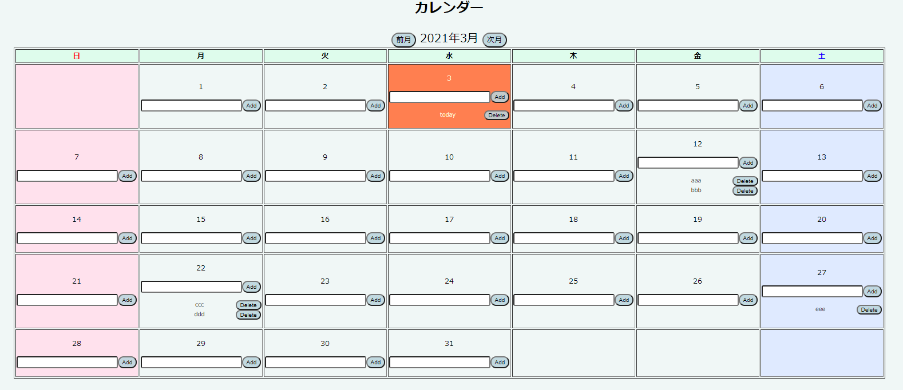

# Memo-In-Calendar
カレンダー型のメモです

## 使い方  
1. MySQLをインストールし、以下のコマンドでDB・テーブルを作成  
■DB  
&ensp; CREATE DATABASE calendar;  
■テーブル  
&ensp; CREATE TABLE data (id INT AUTO_INCREMENT PRIMARY KEY NOT NULL,year VARCHAR(4),month VARCHAR(4),day VARCHAR(4),memo VARCHAR(255),flag INT DEFAULT 0);  

2. nodejs.jsの10,11行目にMySQLアカウントを入力  
  
3. サービスを開始すれば、以下のような画面が表示されます

